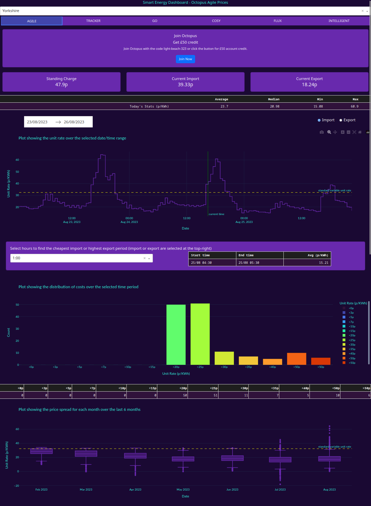

# Smart Energy Dashboard

Created with Plotly Dash, this is a dashboard for viewing the prices of Octopus Energy's smart tariffs.

### Features
 - Information for the following tariffs:
   - Agile
   - Tracker
   - Go
   - Cosy
   - Flux
   - Intelligent
 - Fully interactive plots
 - Comparisons with the standard variable tariff
 - Ability to view both energy import and export rates
 - Cards with standing charge, current import, current export
 - Today's stats with average, median, min and max price
 - Datepicker for selecting time period to view prices from
 - Line chart showing prices changes over time
 - Tool for working out the cheapest import and highest export times
 - Bar plot showing distribution of costs over the selected time period
 - Box plot showing the monthly spread of costs over the last 6 months

### Technology
 - The site gets it's data from a SQL database hosted on Microsoft Azure
 - The database is updated daily through a Python script that pulls the latest prices from the Octopus Energy API, transforms the data, and stores it.

### Screenshot

